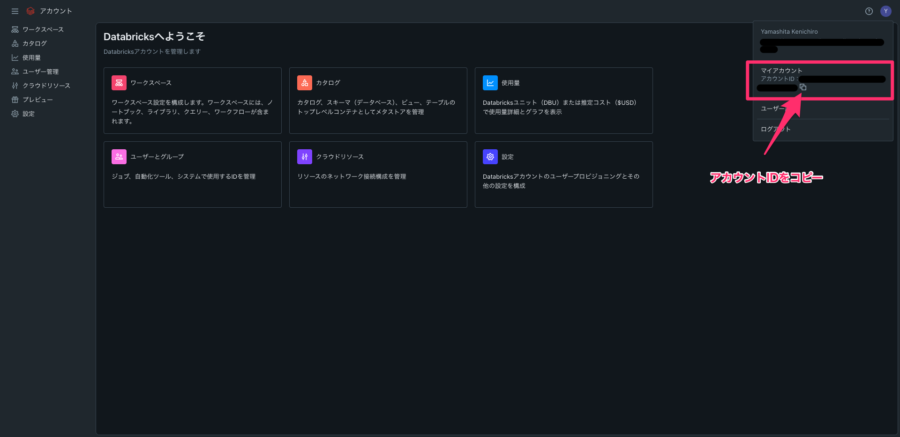
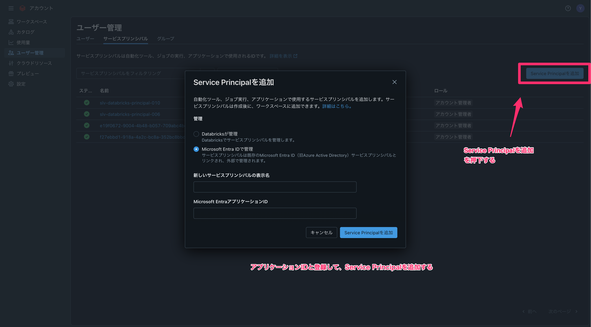
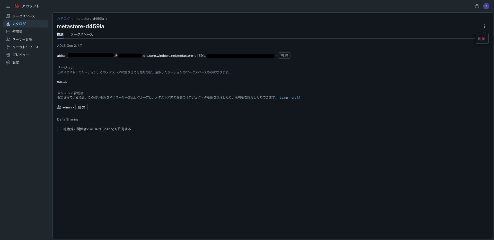

# 目的
本リポジトリの目的は、PoC用に爆速でAzure Databricks環境を立ち上げるためのものである。

# 前提条件
- Azure環境
- Azureサブスクリプション管理者
- Databricksアカウント管理者

# 事前準備
- [Azureにてサービスプリンシパルを作成する](#サービスプリンシパルを作成する)
- [作成したサービスプリンシパルのロールは以下を割り当てる](#サービスプリンシパルにロールを割り当てる)
  - `User Access Administrator`
- [作成したサービスプリンシパルにAzure Key Vaultの権限を付与する](#作成したサービスプリンシパルにazure-key-vaultの権限を付与する)
- [terraform.tfstate管理用のストレージを用意する](#terraformtfstate管理用のストレージを作成する)
- [backend.tfにterraform.tfstateの情報を記載する](#backendtfにterraformtfstateの情報を記載する)
- [Databricks Account IDを調べる](#databricks-account-idを調べる)
- [Databricks Accountに作成したサービスプリンシパルを登録し、admin権限を付与する](#databricks-accountに作成したサービスプリンシパルを登録しadmin権限を付与する)
- [devcontainer.envに環境変数を書き込む](#devcontainerenvに環境変数を書き込む)

## Azureにてサービスプリンシパルを作成する
### azログイン
```bash
# azログイン
az login
```

### サービスプリンシパルを作成する
詳細については、[GitHub Actions で Azure Key Vault を使用して Azure Spring Apps を認証する](https://learn.microsoft.com/ja-jp/azure/spring-apps/basic-standard/github-actions-key-vault)を参照すること。<br>
※[az ad sp create-for-rbac](https://learn.microsoft.com/ja-jp/cli/azure/ad/sp?view=azure-cli-latest#az-ad-sp-create-for-rbac)を参照<br>
サービスプリンシパルのロールは`Contributor`で作成する。
```bash
az ad sp create-for-rbac \
  -n {service_principal_name} \
  --role Contributor \
  --scopes /subscriptions/{subscription_id}
  --json-auth
```

#### 作成結果
```json
{
  "clientId": "{cliend_id}",
  "clientSecret": "{client_secret}",
  "subscriptionId": "{subscription_id}",
  "tenantId": "{tenant_id}",
  "activeDirectoryEndpointUrl": "https://login.microsoftonline.com",
  "resourceManagerEndpointUrl": "https://management.azure.com/",
  "activeDirectoryGraphResourceId": "https://graph.windows.net/",
  "sqlManagementEndpointUrl": "https://management.core.windows.net:8443/",
  "galleryEndpointUrl": "https://gallery.azure.com/",
  "managementEndpointUrl": "https://management.core.windows.net/"
}
```

### サービスプリンシパルにロールを割り当てる
[az role assignment create](https://learn.microsoft.com/ja-jp/cli/azure/role/assignment?view=azure-cli-latest#az-role-assignment-create)を参照
```bash
az role assignment create \
  --role "User Access Administrator" \
  --scope /subscriptions/{subscription_id} \
  --assignee {cliend_id}
```

#### 割り当て結果
```json
{
  "condition": null,
  "conditionVersion": null,
  "createdBy": null,
  "createdOn": "2025-04-28T09:33:53.155099+00:00",
  "delegatedManagedIdentityResourceId": null,
  "description": null,
  "id": "/subscriptions/{subscription_id}/providers/Microsoft.Authorization/roleAssignments/{hoge}",
  "name": "{hoge}",
  "principalId": "{object_id}",
  "principalType": "ServicePrincipal",
  "roleDefinitionId": "/subscriptions/{subscription_id}/providers/Microsoft.Authorization/roleDefinitions/{fuga}",
  "scope": "/subscriptions/{subscription_id}",
  "type": "Microsoft.Authorization/roleAssignments",
  "updatedBy": "{myself_object_id}",
  "updatedOn": "2025-04-28T09:33:53.380103+00:00"
}
```

## 作成したサービスプリンシパルにAzure Key Vaultの権限を付与する
詳細については、[GitHub Actions で Azure Key Vault を使用して Azure Spring Apps を認証する](https://learn.microsoft.com/ja-jp/azure/spring-apps/basic-standard/github-actions-key-vault)を参照すること。

## terraform.tfstate管理用のストレージを作成する
tfstateはTerraformのデプロイ状態を管理するステートファイルになるので、厳重な管理が必要になる。<br>
tfstate用のストレージのアクセス権限に関しては、最新の注意を払って管理をすること。<br>
ストレージなら、どのようなプランでも（基本的に）問題ないはず。

## backend.tfにterraform.tfstateの情報を記載する
tfstateを保存する設定を`backend.tf`に記載する。<br>
記入例は以下を参照する。<br>
※`backend.tf`を用意しないと、tfstateファイルがローカルに保存されるので注意が必要。<br>
※`backend.tf`の内容を適時修正すること。<br>
※tfstateファイルにはセキュアな文字情報も記載されるので最新の注意を払って運用すること。
```tf
terraform {
  backend "azurerm" {
    resource_group_name  = "{resource_group_name}"
    storage_account_name = "{storage_account_name}"
    container_name       = "{container_name}"
    key                  = "hoge.terraform.tfstate"
  }
}
```

## Databricks Account IDを調べる
https://accounts.azuredatabricks.net/ にアクセスし、`Databricks Account ID`を調べる。<br>
以下のアカウントIDをコピーできる。


## Databricks Accountに作成したサービスプリンシパルを登録し、admin権限を付与する


[Databricks Account](https://accounts.azuredatabricks.net/user-management/serviceprincipals)のページから、サービスプリンシパルを追加する。<br>
追加したサービスプリンシパルにロール`アカウント管理者`の権限を付与する。

## devcontainer.envに環境変数を書き込む
`devcontainer.env.template`に、以下の情報を記載し、ファイル名を`devcontainer.env`に変更する。
```env
ARM_CLIENT_ID={servicePrincipal appId(clientId)}
ARM_CLIENT_SECRET={servicePrincipal password}
ARM_SUBSCRIPTION_ID={subscriptionId}
ARM_TENANT_ID={tenantId}
DATABRICKS_ACCOUNT_ID={databricks_account_id}

TF_VAR_ARM_CLIENT_ID={servicePrincipal appId(clientId)}
TF_VAR_ARM_CLIENT_SECRET={servicePrincipal password}
TF_VAR_ARM_SUBSCRIPTION_ID={subscriptionId}
TF_VAR_ARM_TENANT_ID={tenantId}
TF_VAR_DATABRICKS_ACCOUNT_ID={databricks_account_id}
```

以上で、事前準備は完了となる。

# ディレクトリ構成
```
.
├── README.md                              # 本ファイル
├── .github/workflows                      # CI/CD管理用のディレクトリ
├── backend.tf                             # バックエンド管理用tfファイルェックを行う
├── env_dev.tfvars                         # 環境ごとに変更するためのtfvarsファイル
├── main.tf                                # メインの処理
├── outputs.tf                             # アウトプットを管理
├── providers.tf                           # プロバイダを管理
└── variables.tf                           # 変数を管理
```

※`cicd/pipelines/azure*.yml`については、Azure Pipelines用のファイルなので、ここでは説明を割愛する。

# Terraformを実行し、Databricks環境を作成する
Terraformを実行し、Databricks環境を作成する。<br>
以下、手順となる。

- [Tarraformを初期化する](#terraformを初期化する)
- [tflintでコードチェックをする](#tflintでコードチェックをする)
- [tfsecでセキュリティリスクをチェックする](#tfsecでセキュリティリスクをチェックする)
- [Terraformの実行プランを作成する](#terraformの実行プランを作成する)
- [Terraformの実行プランを確認する](#terraformの実行プランを確認する)
- [Terraformの実行プランを適用する](#terraformの実行プランを適用する)
- [リリースをクリーンアップする](#リリースをクリーンアップする)

## Terraformを初期化する
```bash
terraform init -upgrade
```

## tflintでコードチェックをする
```bash
tflint
```

## tfsecでセキュリティリスクをチェックする
```bash
tfsec
```

## Terraformの実行プランを作成する
```bash
terraform plan -var-file="env_dev.tfvars" -out main.dev.tfplan
```

## Terraformの実行プランを確認する
```bash
terraform show main.dev.tfplan
# json形式で確認したい場合
terraform show -json main.dev.tfplan > plan.dev.json
```

## Terraformの実行プランを適用する
```bash
terraform apply -auto-approve main.dev.tfplan
```

## リリースをクリーンアップする
```bash
# クリーンアップ計画を作成する
terraform plan -destroy -var-file="env_dev.tfvars" -out main.dev.destroy.tfplan
# クリーンアップ計画を確認する
terraform show main.dev.destroy.tfplan
# json形式でクリーンアップ計画を確認する
terraform show -json main.dev.destroy.tfplan > plan.dev.destroy.json
# クリーンアップを適用する
terraform apply -destroy -auto-approve main.dev.destroy.tfplan
```

### クリーンアップのエラーについて
以下のエラーが発生する。

```bash
│ Error: cannot delete metastore data access: Storage credential 'default-d459la' cannot be deleted because it is configured as this metastore's root credential. Please update the metastore's root credential before attempting deletion.
```

このエラーは2025年5月現在では必ず発生するエラーで、Geminiの`Deep Research`では以下の回答になる。

#### 結論とベストプラクティス
> エラーの原因は、削除しようとしたストレージ認証情報がメタストアのルート認証情報として設定されていたことにあります。この問題を解決するためには、まず新しいストレージ認証情報を作成し、それをメタストアのルート認証情報として設定してから、古いルート認証情報を削除する必要がありました。
> 
> Terraform は、これらの Databricks リソースをコードとして管理するための強力なツールであり、Databricks UI および CLI は、検証や識別に役立ちます。ストレージ認証情報にはわかりやすい名前を使用することで、混乱を防ぎ、管理を容易にすることができます。Unity Catalog メタストア内のストレージ認証情報は定期的に見直し、管理することが推奨されます。
> 
> インフラストラクチャをコードとして管理するプラクティス (Infrastructure as Code) を Terraform で採用することで、Databricks 環境の一貫性と再現性を確保できます。詳細および高度な構成については、Databricks の公式ドキュメントおよび Databricks Terraform プロバイダーのドキュメントを参照してください。

なので、Databricksアカウントコントロール画面にて手動で認証情報を削除したのちに、リリースのクリーンアップを推奨する。<br>
[カタログ](https://accounts.azuredatabricks.net/data)にアクセスし、当該認証情報を削除する。



`削除`を押下すると削除できる。

# CI/CDについて
最後のCI/CDについて。<br>
本リポジトリでは、`Github Actions`を採用している。<br>
CI/CD管理用に`.github/workflows/`配下にymlファイルを用意しているので、適時参考にされたし。<br>
[Actions](https://github.com/silverlining-yamashita/try-databricks-on-azure/actions)のページを参照されたし。

## .github/workflows/terraform-dev-ci.ymlについて
Pull Requestを作成した際に、tflintとtfsecにてチェックを行っている。

## .github/workflows/terraform-dev-cd.ymlについて
Pull RequestがMergeされると、デプロイワークフローを走らせている。
